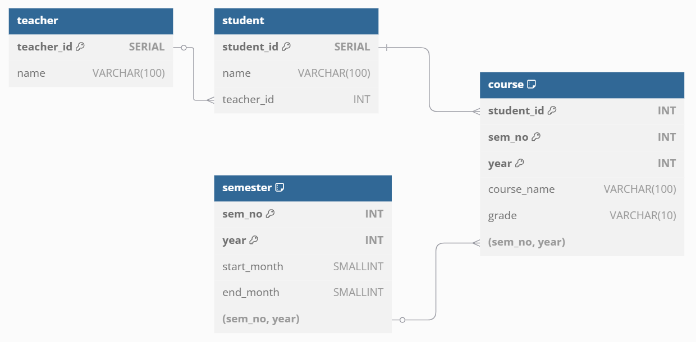

# Project Overview

**Assumptions:**

- **Course Enrollment:**  
  Each student takes multiple courses over many semesters, but only one course per semester.
  
- **Teacher Assignment:**  
  Each student is assigned to one teacher for the entire school duration. For example, if student Tom is assigned to teacher John, Tom will have John as his teacher throughout the program.
  
- **Data Tracking:**  
  The system tracks course names, student names, and teacher names.
  
- **Date Handling:**  
  The database only tracks the month, not the exact date.


---

# Setup Instructions

### 1. Environment Configuration

Create a `.env` file in your project root with your database connection variables. For example:

```env
PGHOST=your_neon_db_host
PGDATABASE=your_neon_db_name
PGUSER=your_neon_db_user
PGPASSWORD=your_neon_db_password

